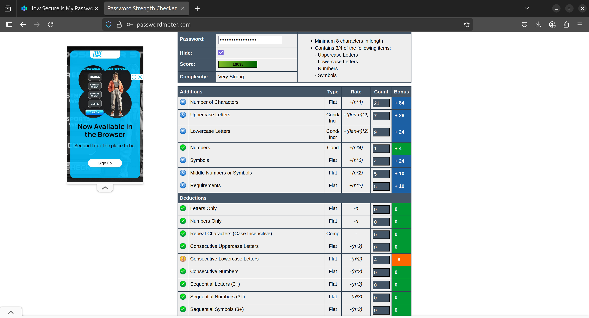
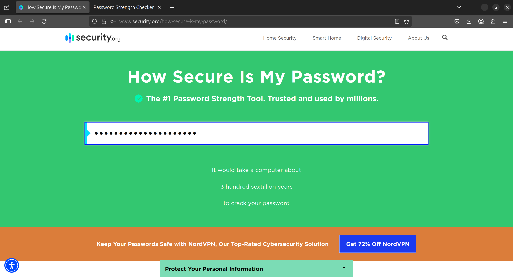
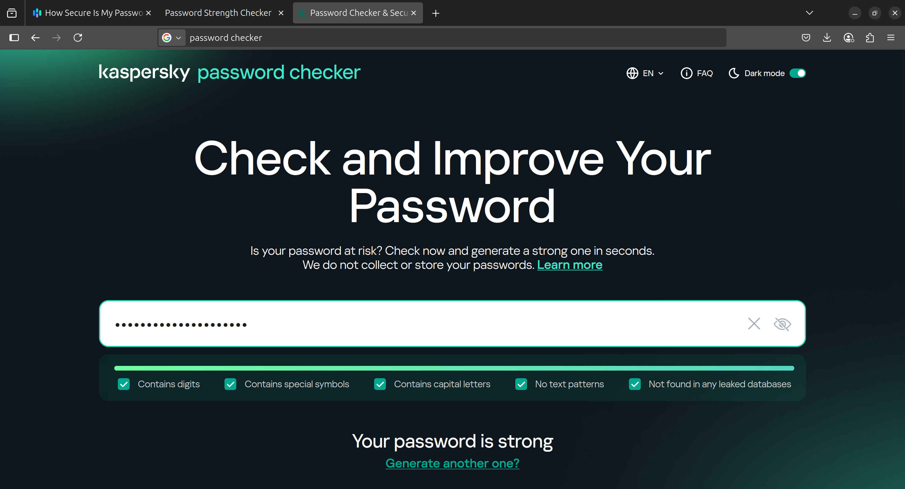

# 🔐 Task 6: Secure Password Generator and Strength Evaluation

## 🚀 Objective

The goal of this task is to understand **what makes a password strong**, generate multiple secure passwords using Python, and evaluate their strength using online tools.

---

## 📁 Project Overview

This project includes:
- A **Python script** to generate strong passwords of varying lengths (16–23 characters).We can generate length upto 256 run code for more details.
- Secure randomization using the `secrets` module and Knuth (Fisher–Yates) shuffle algorithm.
- A sample set of generated passwords.
- Strength test results using tools like:
  - [passwordmeter.com](https://passwordmeter.com)
  - [howsecureismypassword.net](https://howsecureismypassword.net)
  - [password.kaspersky.com/](https://password.kaspersky.com/)

---

## 🧪 Sample Passwords and Strength Results

| Password           | Length | Tool Used                 | Score (%)   | Crack Time Estimate     |
| ------------------ | ------ | ------------------------- | ----------- | ----------------------- |
| `LdE<0Nj}P3Y:(w3vnZL` | 19     | passwordmeter.com         | 100%        | 36 quintillion years      |
| `\XxSyQVM~IL_AXtiA4k-=[V` | 23     | howsecureismypassword.net | 100% | 3 octillion years        |
| `%#UM9njkO8P)_[FZ>a` | 18     | passwordmeter.com         | 100%        | 3 hundred quadrillion years       |
| `A7t$#Nq!MzXvLpW3` | 16     | passwordmeter.com         | 100%       | Practically uncrackable |
| `Zg3#@LpRt7!Vm9XQ` | 16     | howsecureismypassword.net | 100%      | 100 billion years       |

    Note : Use the secure_password_generator to generate secure cryptographic, random passwords.

---

## Code Summary
### 1. Modules Used:

    string: Provides predefined character sets (letters, digits, punctuation).

    secrets: A cryptographically secure random generator, suitable for passwords.

### 2. knuth_shuffle(characters: str)

    Implements the Fisher–Yates shuffle.

    Randomly rearranges characters in a string securely using secrets.randbelow.

    Returns a shuffled version of the input string.

### 3. secure_password_gen(length=16)

    Generates a strong, secure password of specified length (default 16).

    Enforces a valid length range: between 16 and 256 characters.

    Ensures inclusion of:

        1 uppercase letter

        1 lowercase letter

        1 digit

        1 special character

    Fills remaining characters with a mix of all allowed types.

    Finally, shuffles the password using knuth_shuffle to ensure randomness.

### ✅ Output

**Returns a password string that:**

    1. Meets complexity requirements

    2. Has secure randomness

    3. Is suitable for security-sensitive use cases

---

## 🔍 Key Learnings
**🔐 What Makes a Password Strong?**

    At least 16 characters long

    Mix of uppercase, lowercase, digits, and symbols

    No dictionary words or patterns

    Unique per account

**💣 Common Password Attacks**

    1.Brute Force – Tries all combinations.

    2.Dictionary Attack – Uses common passwords/words.

    3.Credential Stuffing – Uses leaked credentials.

    4.Phishing – Tricks user into revealing password.

    5.Keylogging – Captures typed keystrokes.

**🔑 Why Password Length Matters**

    Longer passwords = more combinations = exponentially harder to crack.

🛡️ Tools That Help

    Password Managers – Generate/store unique, strong passwords.

    Multi-Factor Authentication (MFA) – Adds extra verification (OTP, biometrics).

🧠 Tips for Creating Strong Passwords

    1. Use at least 16 characters.

    2. Include all 4 types: uppercase, lowercase, digits, symbols.

    3. Avoid patterns (e.g., 1234, password).

    4. Never reuse passwords.

    5. Use password managers for storage and generation.

---

## Analysis
📷 Password tested on passwordmeter.com
    

📷 Crack time estimated on howsecureismypassword.net
    

📷 Analysis on Kaspersky password checker
    

